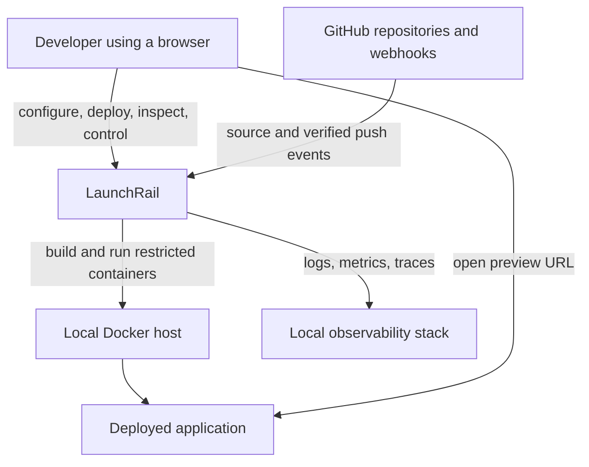
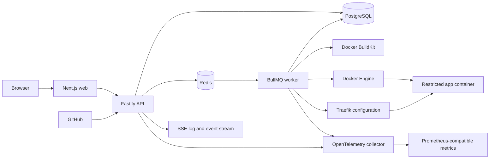

# LaunchRail architecture

## Plain-language overview

LaunchRail separates the quick work of accepting a deployment request from the slow and failure-prone work of cloning, building, starting, and checking an application. The API records intent and queues work; a dedicated worker performs that work and records every meaningful state change. A reverse proxy exposes only releases that LaunchRail has intentionally routed.

The first version is a modular monolith with a separate worker process. This keeps local operation and transactions understandable while preserving boundaries that can be extracted later if measured needs justify it.

## System context



## Runtime containers



The web application may initially be served separately during development. The API remains the authorization and orchestration boundary; browser code does not talk directly to Docker, Redis, or the database.

## Component responsibilities

### Web application

- Presents authentication and the implemented organization project workspace; deployment, log, health, and release controls remain planned.
- Uses generated API types and treats server state as authoritative.
- Consumes server-sent events for ordered, resumable deployment events and log chunks.
- Confirms destructive operations and provides accessible loading, empty, success, and failure states.

### API

- Authenticates users and authorizes every organization-scoped operation.
- Validates repository, project, deployment, health-check, and secret inputs.
- Exposes project create/read/update/archive and write-only environment-variable operations without returning encrypted or plaintext values.
- Persists deployment intent before publishing a job.
- Exposes resource APIs, control endpoints, health endpoints, and event streams.
- Verifies and deduplicates GitHub webhook deliveries.
- Never performs a container build within a request handler.

### Deployment worker

- Claims typed deployment jobs from BullMQ.
- Runs idempotent orchestration steps with bounded retries and timeouts.
- Uses infrastructure ports for clone, build, runtime, routing, health, and logs.
- Persists transitions and failure categories transactionally.
- Emits heartbeat and recovery information and shuts down gracefully.

### PostgreSQL

- Stores identity, configuration metadata, deployment state, event history, encrypted secrets, webhook deliveries, and audit events.
- Provides transaction boundaries for project writes/archival, secret replacement, deployment transitions, and active-release promotion.
- Is the source of truth; Redis queue state is not the authoritative deployment state.

### Redis and BullMQ

- Delivers background jobs, retry scheduling, cancellation signals, and short-lived fan-out notifications.
- Uses stable job and idempotency keys derived from persisted deployment intent.
- Provides at-least-once delivery; consumers must tolerate duplicates.

### Docker BuildKit and Docker Engine

- Build immutable images from constrained repository checkouts.
- Run workloads with explicit CPU, memory, timeout, filesystem, network, and privilege policies.
- Expose operations through adapters rather than domain services calling a Docker client directly.

### Traefik

- Maps generated preview hostnames to known runtime instances.
- Applies route changes only after orchestration authorizes them.
- Supports route restoration from PostgreSQL state after restart.

### Observability services

- Receive structured logs, traces, and metrics through OpenTelemetry conventions.
- Correlate HTTP requests, jobs, deployments, and runtime resources without recording secret values.
- Expose Prometheus-compatible metrics and documented Grafana queries or dashboards.

## Module boundaries

The API and worker share domain and application packages, not framework globals.

| Module        | Owns                                               | Must not own                    |
| ------------- | -------------------------------------------------- | ------------------------------- |
| Identity      | users, sessions, organizations, memberships        | deployment orchestration        |
| Projects      | repository and deployment configuration            | Git clone implementation        |
| Deployments   | state machine, events, promotion, rollback rules   | Docker client calls             |
| Sources       | repository references and commit metadata          | HTTP authorization              |
| Jobs          | typed contracts, idempotency, retry policy         | deployment business rules       |
| Secrets       | encryption and redacted access                     | arbitrary environment rendering |
| Webhooks      | signature validation, deduplication, event mapping | direct build execution          |
| Audit         | actor/action/resource records                      | application logs                |
| Observability | correlation and telemetry contracts                | domain state authority          |

Dependencies point inward: infrastructure adapters depend on application ports, and application services depend on the domain model. The Phase 4 project adapter applies organization filters in PostgreSQL rather than relying on response filtering.

## Infrastructure ports

The initial contracts will be small and capability-oriented:

```ts
interface GitRepositoryProvider {
  resolveRevision(repository: RepositoryRef, revision: string): Promise<ResolvedRevision>;
}

interface RepositoryCloner {
  clone(request: CloneRequest, sink: LogSink, signal: AbortSignal): Promise<Checkout>;
}

interface ImageBuilder {
  build(request: BuildRequest, sink: LogSink, signal: AbortSignal): Promise<BuiltImage>;
}

interface ContainerRuntime {
  start(request: StartRequest): Promise<RuntimeInstance>;
  stop(instanceId: string): Promise<void>;
  streamLogs(instanceId: string, sink: LogSink, signal: AbortSignal): Promise<void>;
}

interface RouteManager {
  activate(route: PreviewRoute, target: RuntimeTarget): Promise<void>;
  remove(route: PreviewRoute): Promise<void>;
  reconcile(expected: ReadonlyArray<ActiveRoute>): Promise<ReconcileResult>;
}

interface DeploymentQueue {
  enqueue(job: DeploymentJob): Promise<EnqueueResult>;
  cancel(deploymentId: string): Promise<void>;
}

interface HealthChecker {
  waitUntilHealthy(
    target: RuntimeTarget,
    policy: HealthPolicy,
    signal: AbortSignal,
  ): Promise<HealthResult>;
}

interface SecretCipher {
  encrypt(plaintext: Uint8Array, context: SecretContext): Promise<EncryptedSecret>;
  decrypt(ciphertext: EncryptedSecret, context: SecretContext): Promise<Uint8Array>;
}
```

GitHub webhook processing is split into signature verification, delivery storage, event mapping, and deployment triggering so duplicate and unsupported events can be handled without invoking infrastructure.

## Initial data model outline

All organization-owned records carry an `organization_id`; authorization queries must include it rather than filtering only after retrieval.

| Entity               | Purpose and key invariants                                                                |
| -------------------- | ----------------------------------------------------------------------------------------- |
| User                 | Human identity; authentication details are stored separately from profile data.           |
| Organization         | Tenant boundary and owner of projects, secrets, deployments, and audit events.            |
| Membership           | Unique user/organization pair with an explicit role.                                      |
| Session              | Hashed opaque token metadata, expiry, and revocation state.                               |
| Project              | Repository reference, selected branch, Dockerfile path, runtime and health configuration. |
| Deployment           | Immutable source revision plus current state, attempt, failure category, and timestamps.  |
| Deployment event     | Append-only transition and diagnostic history with monotonic ordering per deployment.     |
| Build log            | Ordered, bounded log chunks with redaction applied before persistence or fan-out.         |
| Runtime instance     | Container/image identifiers, lifecycle state, resource metadata, and cleanup status.      |
| Active release       | One project-level pointer updated atomically only after health succeeds.                  |
| Environment variable | Name, scope, encrypted value, key version, and redacted metadata.                         |
| Webhook delivery     | Unique provider delivery ID, verification result, processing result, and received time.   |
| Audit event          | Immutable actor, action, target, organization, outcome, and correlation metadata.         |

Database constraints enforce unique memberships, unique active project names, typed project bounds, unique webhook deliveries, one active release per project, valid identifiers, authenticated-encryption envelope shape, and referential ownership. Project configuration and deployment transition services lock affected rows and append audit/event records within their state-changing transaction.

## Key request flows

### Manage project configuration

1. The API authenticates the session and checks an organization role permission.
2. Transport schemas reject unknown/malformed shapes; domain rules normalize the canonical GitHub URL and validate branch, relative Dockerfile, origin-only health path, port, and runtime bounds.
3. The PostgreSQL adapter scopes by organization and writes the project plus audit event in one transaction.
4. Update/archive operations lock the row and compare `expectedVersion`; stale clients receive a conflict.
5. Archive rejects an active release or non-terminal deployment, purges encrypted variables, retains terminal deployment history, increments the version, and hides the project from active reads.

### Store environment variable

1. The API requires owner/admin secret permission and validates the normalized uppercase name and UTF-8 value size.
2. AES-256-GCM encrypts the value with a fresh nonce and an authentication tag. Additional authenticated data binds the purpose/envelope version to organization, project, and variable name.
3. The adapter replaces ciphertext and envelope metadata transactionally and records a value-free audit event.
4. API reads expose only variable IDs, names, and timestamps to owner/admin users. Plaintext, ciphertext, nonce, tag, algorithm, and key version never cross the response boundary.

### Start deployment

1. The API authorizes the actor and validates project configuration.
2. In PostgreSQL, it creates an immutable deployment request and an initial `queued` event.
3. After commit, it enqueues a job using the deployment ID as the stable key.
4. A reconciliation path republishes persisted queued work if enqueueing fails.
5. The worker locks/claims the deployment and advances it through valid transitions.

### Promote healthy release

1. The worker starts a candidate runtime without changing the active route.
2. Health checks run against the candidate directly.
3. A database transaction verifies the candidate state and records the active-release decision.
4. The route adapter switches traffic and reports the applied configuration.
5. Reconciliation repairs a route/database mismatch after a crash; the previous runtime is retained until activation is confirmed.

The lifecycle and crash windows are specified in [docs/deployment-lifecycle.md](docs/deployment-lifecycle.md).

## Delivery and consistency guarantees

- Queue and webhook processing are **at least once**, not exactly once.
- Deployment commands use stable idempotency keys and compare persisted state before side effects.
- PostgreSQL is authoritative for desired state; Docker and Traefik are reconciled external state.
- Logs may be delivered more than once across reconnects and therefore carry sequence identifiers.
- Promotion is transactional at the data layer and convergent at the proxy layer; the exact crash behavior will be tested and documented.

## Repository layout

```text
apps/
  api/          Fastify HTTP and event-stream adapters
  web/          Next.js user interface
  worker/       BullMQ consumers and orchestration
packages/
  contracts/    API, event, and job schemas
  config/       validated shared configuration
  domain/       framework-independent deployment rules
  application/  use cases and persistence ports
  database/     Drizzle schema, migrations, and PostgreSQL adapters
  observability/ telemetry setup and conventions
docs/           lifecycle, operations, decisions, and evidence
```

Phases 1 through 4 implement the listed application entry points plus the `contracts`, `config`, `observability`, `domain`, `application`, and `database` packages. Database adapters persist deployment transitions/promotions, identity/session data, organization-scoped projects, AES-256-GCM environment-variable envelopes, and audit records. The Fastify boundary authenticates browser sessions and authorizes identity and project routes; the Next.js workspace exposes role-aware project and secret controls. Later phases connect deployment use cases to the queue/worker and add healthy and intentionally failing `examples/` applications alongside the adapters they test.

## Architecture decisions

Accepted decisions are recorded in [docs/adr](docs/adr):

- [ADR-0001: Modular monolith with a separate worker](docs/adr/0001-modular-monolith-and-worker.md)
- [ADR-0002: Fastify, Next.js, and shared TypeScript contracts](docs/adr/0002-application-stack.md)
- [ADR-0003: PostgreSQL, Drizzle, Redis, and BullMQ](docs/adr/0003-persistence-and-jobs.md)
- [ADR-0004: Docker BuildKit, Traefik, and server-sent events](docs/adr/0004-deployment-infrastructure.md)
- [ADR-0005: License LaunchRail under Apache 2.0](docs/adr/0005-apache-2-license.md)

## Known limitations

Phases 1 through 4 implement process boundaries, shared foundations, deployment-domain/persistence rules, local-password authentication, organization authorization, and project configuration/secret API and UI paths. The canonical GitHub URL is syntactically validated but not contacted: repository existence/private access, revision resolution, cloning, and symlink containment remain Phase 6. Project settings and secrets are not yet injected into queue jobs or runtimes; automated key re-encryption, password recovery/second factors, queue, build, runtime, routing, and full telemetry adapters remain later phases. Single-host Docker remains a large trust and failure boundary; nothing in this architecture makes LaunchRail production-ready or safe for hostile public multi-tenancy.
