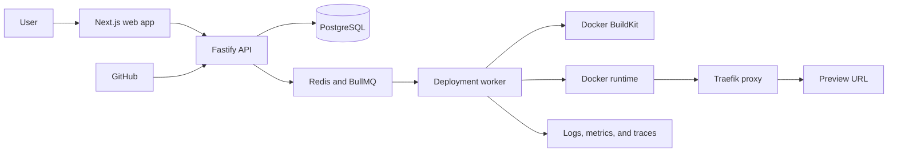

# LaunchRail

**A self-hosted platform that turns a GitHub repository into a health-checked application deployment with live logs, preview URLs, release history, and safe rollback.**

> Phase 3 is complete: LaunchRail now has bootstrapped owner accounts, opaque server-side sessions, role-based organization authorization, hardened browser requests, audit history, and a working sign-in surface.

## What LaunchRail does

LaunchRail is designed to take an application stored on GitHub, build it automatically, run it in an isolated container, check whether it started successfully, and give the user a URL where it can be accessed.

The finished local demonstration will let a user:

- Connect a GitHub repository and select a revision to deploy.
- Watch build and runtime logs as they happen.
- Open a generated preview URL after health checks pass.
- Inspect deployment history and actionable failure details.
- Retry, cancel, stop, or roll back a release.
- Trigger deployments from verified GitHub push webhooks.

The engineering challenge goes beyond starting a container: LaunchRail must coordinate long-running jobs, preserve the last healthy release when a new one fails, recover safely after worker restarts, isolate organizations, and expose enough telemetry to explain what happened.

## How it fits together



LaunchRail will use a modular monolith for the web/API boundary and a separate worker for deployment jobs. Infrastructure-specific behavior sits behind explicit interfaces so the core deployment rules do not depend directly on Docker, GitHub, Redis, or the web framework. See [ARCHITECTURE.md](ARCHITECTURE.md) for the technical design.

## Current status

### Available

- Product scope, target users, success criteria, and non-goals.
- Proposed architecture and initial technology decisions.
- Deployment lifecycle and explicit state-machine design.
- Initial threat model, security boundaries, and phased roadmap.
- Pinned pnpm workspace with Next.js web, Fastify API, worker, and shared packages.
- Health endpoints for all three applications and structured API/worker logging.
- Validated environment configuration with actionable errors and production guards.
- Loopback-only PostgreSQL and Redis development services with health checks.
- Formatting, linting, type checking, unit/integration tests, builds, smoke tests, and GitHub Actions.
- Apache 2.0 open-source license.
- Organization-scoped users, memberships, projects, deployments, events, logs, runtime instances, encrypted-variable metadata, webhook deliveries, and audit events.
- Generated Drizzle migrations plus an immutable deployment snapshot guard.
- Central fourteen-state deployment lifecycle with exhaustive valid/invalid transition tests.
- Transactional, idempotent PostgreSQL transitions that append ordered events and audit records.
- Health-gated promotion that atomically supersedes the previous release and maintains one active pointer.
- Scrypt password credentials and bootstrapped first-owner setup without logged secrets.
- Hashed opaque sessions with absolute/idle expiry, rolling activity, and revocation.
- Owner, admin, developer, and viewer permission policies enforced at organization API boundaries.
- Cross-organization concealment, strict origin checks, sign-in throttling, secure cookie policy, and security headers.
- Organization member management, audit-history APIs, and a responsive sign-in/session surface.
- Real-PostgreSQL authorization coverage for every role and protected cross-organization path.

### In progress

- No implementation milestone is currently in progress.

### Planned next

- Organization-scoped project CRUD.
- Safe GitHub repository, Dockerfile, health-check, and runtime configuration.
- Encrypted environment-variable management and project UI.

### Not currently planned

- Kubernetes, multi-region deployment, billing, enterprise SSO, and public multi-tenant hosting.
- A custom container runtime, mobile apps, or AI deployment recommendations.

## Try it locally

Prerequisites: Node.js 22.22 or newer, Corepack/pnpm 11.9, Docker, and Docker Compose.

```bash
corepack enable
pnpm install --frozen-lockfile
cp .env.example .env
pnpm services:up
pnpm db:migrate
# Set the LAUNCHRAIL_BOOTSTRAP_* values in .env, then run:
pnpm auth:bootstrap
pnpm dev
```

Open [http://localhost:3000](http://localhost:3000). Foundation health endpoints are available at:

- Web: `http://localhost:3000/api/health`
- API: `http://localhost:4000/health`
- Worker: `http://localhost:4001/health`

Stop the application processes with `Ctrl+C`, then stop PostgreSQL and Redis without deleting their volumes:

```bash
pnpm services:down
```

See the [development guide](docs/development.md) for verification, configuration, cleanup, and troubleshooting.

## Documentation

- [Product scope](docs/product-scope.md)
- [Architecture](ARCHITECTURE.md)
- [Deployment lifecycle](docs/deployment-lifecycle.md)
- [Security policy](SECURITY.md) and [threat model](docs/threat-model.md)
- [Roadmap](ROADMAP.md) and [changelog](CHANGELOG.md)
- [Contributing](CONTRIBUTING.md) and [development workflow](docs/development.md)
- [Testing strategy](docs/testing.md), [observability design](docs/observability.md), and [benchmark methodology](docs/benchmarks.md)
- [Persistence model and transaction rules](docs/persistence.md)
- [Authentication and authorization](docs/authentication.md)
- [Architecture decisions](docs/adr/)

## Current limitations

LaunchRail is not production-ready. Authentication currently uses local password credentials and does not provide password reset, invitations, MFA, SSO, or session administration. The API exposes identity and organization access only; there is no project UI, repository connection, queue consumer, build pipeline, application deployment, preview routing, or rollback control. Health endpoints still report process liveness only.

## License

LaunchRail is licensed under the [Apache License 2.0](LICENSE). See [ADR-0005](docs/adr/0005-apache-2-license.md) for the decision.
