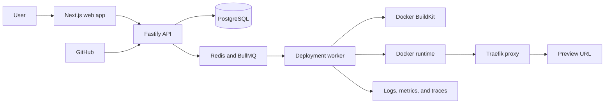

# LaunchRail

**A self-hosted platform that turns a GitHub repository into a health-checked application deployment with live logs, preview URLs, release history, and safe rollback.**

> **Phase 5 is Available.** Clean PostgreSQL/Redis CI verifies typed identifier-only jobs, durable leases and attempts, bounded retries, dead letters, operational heartbeats, reconciliation, and graceful shutdown.

## What LaunchRail does

LaunchRail is designed to take an application stored on GitHub, build it automatically, run it in an isolated container, check whether it started successfully, and give the user a URL where it can be accessed.

The finished local demonstration will let a user:

- Connect a GitHub repository and select a revision to deploy.
- Watch build and runtime logs as they happen.
- Open a generated preview URL after health checks pass.
- Inspect deployment history and actionable failure details.
- Retry, cancel, stop, or roll back a release.
- Trigger deployments from verified GitHub push webhooks.

The engineering challenge goes beyond starting a container: LaunchRail must coordinate long-running jobs, preserve the last healthy release when a new one fails, recover safely after worker restarts, isolate organizations, and expose enough telemetry to explain what happened.

## How it fits together



LaunchRail will use a modular monolith for the web/API boundary and a separate worker for deployment jobs. Infrastructure-specific behavior sits behind explicit interfaces so the core deployment rules do not depend directly on Docker, GitHub, Redis, or the web framework. See [ARCHITECTURE.md](ARCHITECTURE.md) for the technical design.

## Current status

### Available

- Product scope, target users, success criteria, and non-goals.
- Proposed architecture and initial technology decisions.
- Deployment lifecycle and explicit state-machine design.
- Initial threat model, security boundaries, and phased roadmap.
- Pinned pnpm workspace with Next.js web, Fastify API, worker, and shared packages.
- Health endpoints for all three applications and structured API/worker logging.
- Validated environment configuration with actionable errors and production guards.
- Loopback-only PostgreSQL and Redis development services with health checks.
- Formatting, linting, type checking, unit/integration tests, builds, smoke tests, and GitHub Actions.
- Apache 2.0 open-source license.
- Organization-scoped users, memberships, projects, deployments, events, logs, runtime instances, encrypted-variable metadata, webhook deliveries, and audit events.
- Generated Drizzle migrations plus an immutable deployment snapshot guard.
- Central fourteen-state deployment lifecycle with exhaustive valid/invalid transition tests.
- Transactional, idempotent PostgreSQL transitions that append ordered events and audit records.
- Health-gated promotion that atomically supersedes the previous release and maintains one active pointer.
- Scrypt password credentials and bootstrapped first-owner setup without logged secrets.
- Hashed opaque sessions with absolute/idle expiry, rolling activity, and revocation.
- Owner, admin, developer, and viewer permission policies enforced at organization API boundaries.
- Cross-organization concealment, strict origin checks, sign-in throttling, secure cookie policy, and security headers.
- Organization member management, audit-history APIs, and a responsive sign-in/session surface.
- Real-PostgreSQL authorization coverage for every role and protected cross-organization path.
- Organization-scoped project create, read, update, and soft-archive APIs with optimistic versions and audited writes.
- Canonical `https://github.com/owner/repository` input plus safe branch, Dockerfile, health-check, and bounded runtime configuration.
- AES-256-GCM environment-variable storage with fresh nonces, authentication tags, a versioned keyring, and organization/project/name-bound authenticated context.
- Write-only secret values: owner/admin users receive names and timestamps, while plaintext is never returned by project APIs.
- Responsive `/projects` workspace with role-aware create, edit, archive, and environment-variable controls.
- Strict `deployment.claim` wake-ups carrying only a contract version, supported kind, and opaque PostgreSQL work-item ID.
- Durable PostgreSQL attempts, due times, leases, fencing, dead-letter state, and operational worker heartbeats are implemented.
- The worker uses at-least-once BullMQ wake-ups, PostgreSQL-managed retry/reconciliation, and an atomic leased `queued` to `cloning` transition plus work-item completion.
- Clean disposable PostgreSQL/Redis acceptance, code-quality, build, and health checks are verified by [GitHub Actions run 31408251857](https://github.com/Zamuel66666/LaunchRail/actions/runs/31408251857).

### Planned next

- Public GitHub repository and exact revision resolution behind explicit source-provider ports.
- Bounded checkout with metadata persistence and path/symlink containment.
- Dockerfile existence and containment validation before any build is attempted.

### Not currently planned

- Kubernetes, multi-region deployment, billing, enterprise SSO, and public multi-tenant hosting.
- A custom container runtime, mobile apps, or AI deployment recommendations.

## Try it locally

Prerequisites: Node.js 22.22 or newer, Corepack/pnpm 11.9, Docker, and Docker Compose.

```bash
corepack enable
pnpm install --frozen-lockfile
cp .env.example .env
# Generate a local project-secret key directly into the untracked .env file.
node -e "process.stdout.write('LAUNCHRAIL_SECRET_KEYRING=1:'+require('node:crypto').randomBytes(32).toString('base64url')+'\nLAUNCHRAIL_ACTIVE_SECRET_KEY_VERSION=1\n')" >> .env
pnpm services:up
pnpm db:migrate
# Set the LAUNCHRAIL_BOOTSTRAP_* values in .env, then run:
pnpm auth:bootstrap
pnpm dev
```

Never commit `.env` or the generated key. Open [http://localhost:3000/projects](http://localhost:3000/projects) for project management or [http://localhost:3000](http://localhost:3000) for the recruiter-readable overview. Health endpoints are available at:

- Web: `http://localhost:3000/api/health`
- API: `http://localhost:4000/health`
- Worker: `http://localhost:4001/health`

Stop the application processes with `Ctrl+C`, then stop PostgreSQL and Redis without deleting their volumes:

```bash
pnpm services:down
```

See the [development guide](docs/development.md) for verification, configuration, cleanup, and troubleshooting.

## Documentation

- [Product scope](docs/product-scope.md)
- [Architecture](ARCHITECTURE.md)
- [Deployment lifecycle](docs/deployment-lifecycle.md)
- [Security policy](SECURITY.md) and [threat model](docs/threat-model.md)
- [Roadmap](ROADMAP.md) and [changelog](CHANGELOG.md)
- [Contributing](CONTRIBUTING.md) and [development workflow](docs/development.md)
- [Testing strategy](docs/testing.md), [observability design](docs/observability.md), and [benchmark methodology](docs/benchmarks.md)
- [Persistence model and transaction rules](docs/persistence.md)
- [Authentication and authorization](docs/authentication.md)
- [Project management and secret rotation](docs/project-management.md)
- [Queue and worker operations](docs/queue-worker.md)
- [Architecture decisions](docs/adr/)

## Current limitations

LaunchRail is not production-ready. Authentication remains local-password only without password reset, invitations, MFA, SSO, or session administration. There is no deployment-start HTTP endpoint or deployment UI yet. Project configuration does not verify that a GitHub repository, branch, or Dockerfile exists; private-repository authentication, revision resolution, cloning, and checkout/symlink containment arrive in Phase 6. Saved configuration and secrets are not placed in Redis or injected into workloads, and automated key re-encryption is not implemented. The verified worker foundation currently demonstrates only an idempotent `queued` to `cloning` claim. Repository access, builds, application runtimes, preview routing, activation, log streaming, deployment controls, webhooks, and full telemetry remain later phases. Application health endpoints and `pnpm smoke:health` prove process liveness only, not queue/database readiness. The current production dependency audit is also non-green (11 high and 7 moderate advisories in existing Next.js/Fastify dependency paths), so dependency remediation is required before any production claim.

## License

LaunchRail is licensed under the [Apache License 2.0](LICENSE). See [ADR-0005](docs/adr/0005-apache-2-license.md) for the decision.
