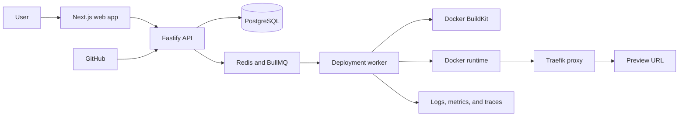

# LaunchRail

**A self-hosted platform that turns a GitHub repository into a health-checked application deployment with live logs, preview URLs, release history, and safe rollback.**

> LaunchRail is currently in the product-definition phase. The architecture and delivery plan are documented; the runnable platform begins in Phase 1.

## What LaunchRail does

LaunchRail is designed to take an application stored on GitHub, build it automatically, run it in an isolated container, check whether it started successfully, and give the user a URL where it can be accessed.

The finished local demonstration will let a user:

- Connect a GitHub repository and select a revision to deploy.
- Watch build and runtime logs as they happen.
- Open a generated preview URL after health checks pass.
- Inspect deployment history and actionable failure details.
- Retry, cancel, stop, or roll back a release.
- Trigger deployments from verified GitHub push webhooks.

The engineering challenge goes beyond starting a container: LaunchRail must coordinate long-running jobs, preserve the last healthy release when a new one fails, recover safely after worker restarts, isolate organizations, and expose enough telemetry to explain what happened.

## How it fits together

LaunchRail will use a modular monolith for the web/API boundary and a separate worker for deployment jobs. Infrastructure-specific behavior sits behind explicit interfaces so the core deployment rules do not depend directly on Docker, GitHub, Redis, or the web framework. See [ARCHITECTURE.md](ARCHITECTURE.md) for the technical design.

## Current status

### Available

- Product scope, target users, success criteria, and non-goals.
- Proposed architecture and initial technology decisions.
- Deployment lifecycle and explicit state-machine design.
- Initial threat model, security boundaries, and phased roadmap.
- Contribution and local development workflow for the documentation phase.

### In progress

- No implementation milestone is currently in progress.

### Planned next

- pnpm workspace with web, API, worker, and shared packages.
- PostgreSQL and Redis development services in Docker Compose.
- Formatting, linting, type checking, tests, and GitHub Actions.
- Health endpoints and validated environment configuration.

### Not currently planned

- Kubernetes, multi-region deployment, billing, enterprise SSO, and public multi-tenant hosting.
- A custom container runtime, mobile apps, or AI deployment recommendations.

## Try it locally

There is not yet a runnable application. Phase 1 will introduce a one-command local development environment and this section will be replaced with tested setup commands. Until then, the product can be reviewed through the documentation:

1. Read the [product scope](docs/product-scope.md) for the user problem and boundaries.
2. Review the [deployment lifecycle](docs/deployment-lifecycle.md) for the core safety behavior.
3. Follow progress in the [roadmap](ROADMAP.md).

## Documentation

- [Product scope](docs/product-scope.md)
- [Architecture](ARCHITECTURE.md)
- [Deployment lifecycle](docs/deployment-lifecycle.md)
- [Security policy](SECURITY.md) and [threat model](docs/threat-model.md)
- [Roadmap](ROADMAP.md) and [changelog](CHANGELOG.md)
- [Contributing](CONTRIBUTING.md) and [development workflow](docs/development.md)
- [Testing strategy](docs/testing.md), [observability design](docs/observability.md), and [benchmark methodology](docs/benchmarks.md)
- [Architecture decisions](docs/adr/)

## Current limitations

LaunchRail is not production-ready and currently contains documentation only. No authentication, repository connection, builds, deployments, preview URLs, or rollback behavior has been implemented yet. The first supported environment will be a single local Docker host, and early releases will prioritize public GitHub repositories before private-repository authentication.

## License

A project license has not yet been selected. Until one is added, the source is not offered under an open-source license despite the project's open-source goal. License selection is tracked in the roadmap.
