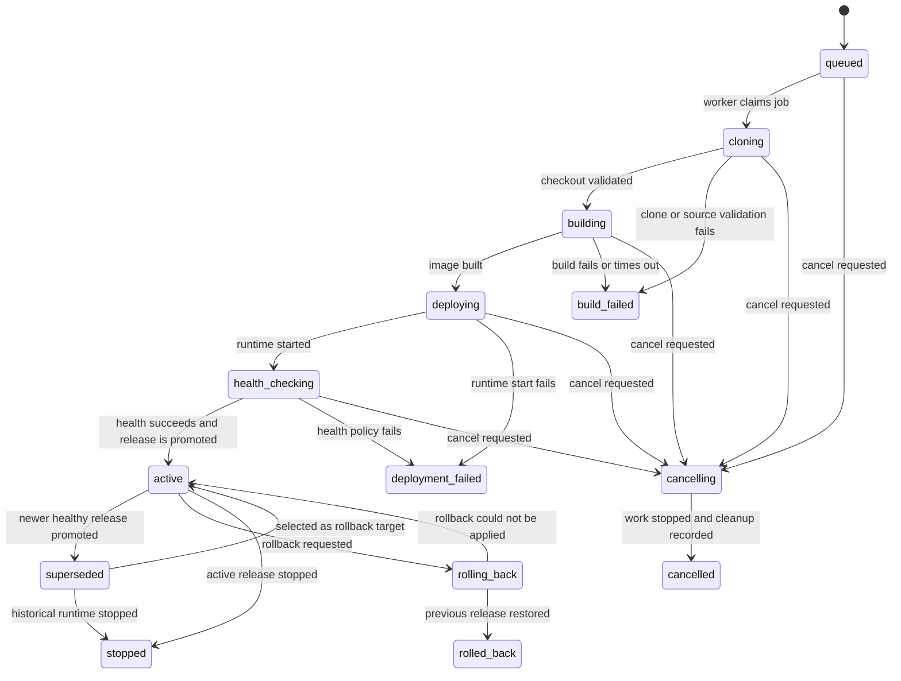

# Deployment lifecycle and state model

## Plain-language overview

A deployment is a recorded attempt to turn one exact source revision into a running release. LaunchRail never treats “the container started” as success. A candidate must build, start, and pass its configured health checks before it can replace the current release.

If a candidate fails, the previously healthy release stays active. Every step is recorded so a user can see what happened, and a restarted worker reconstructs work from PostgreSQL rather than assuming an in-memory job completed.

This document defines the intended Phase 2 state model and later orchestration behavior. Phase 0 does not implement these transitions yet.

## Terms

- **Deployment:** an immutable attempt for a project, repository revision, and configuration snapshot.
- **Candidate:** a deployment that has not yet been promoted.
- **Release:** a deployment that reached `active` at least once.
- **Active release:** the single deployment a project's primary preview route is intended to serve.
- **Runtime instance:** the container created for a deployment; instances have their own cleanup status.
- **Transition:** a validated change from one deployment state to another with an appended event.
- **Attempt:** one worker execution of the same persisted deployment, not a new deployment record.

## State groups

| Group | States | Meaning |
| --- | --- | --- |
| Waiting | `queued` | Persisted and eligible for worker processing. |
| Preparing | `cloning`, `building` | Resolving source and producing an immutable image. |
| Releasing | `deploying`, `health_checking` | Starting and validating a candidate runtime. |
| Serving/history | `active`, `superseded`, `rolling_back`, `rolled_back`, `stopped` | Release routing and operator-controlled history. |
| Cancellation | `cancelling`, `cancelled` | Cancellation requested and cleanup completed. |
| Failure | `build_failed`, `deployment_failed` | Terminal attempt failure before activation. |

`build_failed`, `deployment_failed`, `cancelled`, `rolled_back`, and `stopped` are terminal for that deployment attempt. `superseded` remains eligible to become `active` during a rollback.

## State diagram

## Valid transition table

All transition commands go through one domain service. Direct state updates outside that service are prohibited.

| From | Allowed destination | Required condition or effect |
| --- | --- | --- |
| `queued` | `cloning` | Worker owns a valid lease/idempotency claim. |
| `queued` | `cancelling` | Authorized cancellation was persisted. |
| `cloning` | `building` | Exact commit and Dockerfile were validated and stored. |
| `cloning` | `build_failed` | A structured source/clone failure is stored. |
| `cloning` | `cancelling` | Cancellation signal observed. |
| `building` | `deploying` | Image digest and build completion event are stored. |
| `building` | `build_failed` | A structured build failure or timeout is stored. |
| `building` | `cancelling` | Cancellation signal observed. |
| `deploying` | `health_checking` | Runtime identifier and direct health target are stored. |
| `deploying` | `deployment_failed` | A structured runtime-start failure is stored. |
| `deploying` | `cancelling` | Cancellation signal observed. |
| `health_checking` | `active` | Health policy passed; promotion transaction succeeds. |
| `health_checking` | `deployment_failed` | Grace period or health policy is exhausted. |
| `health_checking` | `cancelling` | Cancellation wins before promotion begins. |
| `cancelling` | `cancelled` | Build/runtime cancellation and required cleanup are recorded. |
| `active` | `superseded` | A different healthy release is promoted for the same project. |
| `active` | `rolling_back` | Authorized rollback target was validated. |
| `rolling_back` | `rolled_back` | The prior healthy target becomes active and route intent changes. |
| `rolling_back` | `active` | Rollback fails before route intent changes; failure event is appended. |
| `superseded` | `active` | It is the validated rollback target in the same promotion transaction. |
| `active` | `stopped` | Route intent is removed and no active release remains. |
| `superseded` | `stopped` | Retained historical runtime is intentionally stopped. |

Any other pair is invalid and must return a typed conflict without changing persistence. Repeating a transition command with the same idempotency key returns the recorded result.

## Core invariants

1. A project has at most one active-release pointer.
2. Only a deployment that completed health checks may become active.
3. A failed candidate never changes the active-release pointer.
4. Every state change and its deployment event commit in the same database transaction.
5. Each deployment references one immutable commit SHA and configuration snapshot.
6. A worker cannot move a deployment from a state it did not lock and re-read.
7. Terminal failure records contain a stable category and a redacted user-facing message.
8. Promotion updates the new deployment, previous deployment, active pointer, and events atomically in PostgreSQL.
9. External Docker and Traefik state is reconciled to persisted desired state after crashes.
10. Secrets never appear in state events, logs, failure details, job payloads, metrics, or traces.

## Transactional transition algorithm

For an ordinary transition:

1. Start a PostgreSQL transaction.
2. Lock the deployment row and load its project ownership and current state.
3. Check the command's idempotency key and return the prior result if already applied.
4. Validate the requested transition against the central transition map and command-specific preconditions.
5. Update state, timestamps, attempt/failure fields, and optimistic version.
6. Append a sequenced deployment event and idempotency record.
7. Commit, then publish a best-effort stream notification.

Clients recover missed notifications by reading events after their last sequence. Stream delivery is not part of the database transaction.

## Healthy activation

Candidate health checks use a direct runtime address, not the active user route. After the health policy passes, one transaction:

1. Locks the project and current active-release rows.
2. Confirms the candidate is still `health_checking` and not cancelled.
3. Marks the old active deployment `superseded`, when one exists.
4. Marks the candidate `active`.
5. Replaces the project's active-release pointer.
6. Appends events for both releases and an audit event.

After commit, the route adapter applies persisted route intent. The old runtime is retained for a configured window. If the worker crashes before route application, reconciliation completes the switch. If route application repeatedly fails, the system records a routing failure and follows a tested compensation policy; it does not report a working preview until observed routing matches desired state.

## Failed candidate behavior

A clone, build, runtime-start, or health failure records the correct terminal state and category. LaunchRail removes candidate routes/resources as appropriate but does not modify the active-release pointer. The UI shows the candidate failure alongside the still-serving release.

## Cancellation

Cancellation is cooperative and safe at step boundaries:

1. An authorized request transitions eligible work to `cancelling` and signals the queue/worker.
2. The worker aborts clone/build/health operations using a bounded signal.
3. Started candidate containers and temporary routes are removed.
4. Cleanup results are persisted before `cancelled`.

Once the activation transaction starts, cancellation loses the race and receives a conflict; the user may then stop or roll back the active release. Cleanup failures are tracked separately for reconciliation rather than leaving the deployment indefinitely in `cancelling`.

## Rollback

Rollback accepts only a previously healthy `superseded` release belonging to the same project. LaunchRail verifies that its image and configuration are still available, starts or checks its runtime if necessary, and health-checks it before changing route intent.

The current active release moves to `rolling_back` while this preparation is controlled. On success, one transaction moves it to `rolled_back`, returns the target from `superseded` to `active`, changes the active pointer, and appends deployment and audit events. On a pre-switch failure, the current release returns to `active` and remains routed. Concurrent promotions, stops, and rollbacks serialize on the project row.

## Retry semantics

- Retrying a failed deployment creates a new deployment record linked to the original; immutable source/configuration may be copied explicitly.
- Retrying a transient worker step for the same deployment increments an attempt counter and reuses stable side-effect keys.
- Retries use capped exponential backoff with jitter and a configurable maximum.
- Exhausted work records a terminal failure and dead-letter metadata visible to operators.
- “Retry” never mutates a historical failure into a success.

## Worker restart and recovery

PostgreSQL, not the BullMQ job, is authoritative. A heartbeat/reconciliation process identifies stale nonterminal deployments. Based on the persisted state and observed resources, it can re-enqueue an idempotent step, adopt a matching resource, finish cleanup, or record a structured unrecoverable failure.

Examples:

- `queued` without a BullMQ job is re-enqueued.
- `building` with no live build and an expired lease is retried within policy.
- `deploying` with a matching labeled container adopts that runtime instead of starting a duplicate.
- `health_checking` resumes checks against the recorded candidate.
- Applied proxy routes that disagree with active-release intent are reconciled and audited.

No restart silently marks work complete.

## Failure categories

Stable categories support UI guidance and metrics without exposing raw secrets:

- `source_invalid`, `source_unavailable`, `clone_timeout`
- `dockerfile_missing`, `build_rejected`, `build_timeout`, `build_failed`
- `runtime_policy_rejected`, `runtime_start_failed`, `runtime_timeout`
- `health_timeout`, `health_unhealthy`, `health_invalid_response`
- `route_conflict`, `route_apply_failed`
- `cancel_timeout`, `cleanup_failed`
- `infrastructure_unavailable`, `internal_invariant_violation`

Raw adapter errors remain in access-controlled structured logs after redaction. User-facing messages identify the failed stage, a safe reason, and a next action.

## Test obligations

Before this model can be marked available, tests must prove:

- Every listed transition succeeds and every unlisted transition fails without writes.
- State and event persistence roll back together.
- Duplicate commands and duplicate jobs do not repeat external side effects.
- Concurrent promotion yields one active release.
- Failed and cancelled candidates preserve the active release.
- Worker termination at each side-effect boundary converges after restart.
- Rollback either preserves the current route or activates the selected healthy target.
- Cross-project and cross-organization targets are rejected.
- Event and failure output is redacted.

## Current limitations

This design assumes one Docker host and one active route per project. Route switching is not a distributed transaction with PostgreSQL; correctness depends on idempotent adapters, observed-state recording, compensation, and reconciliation. Those behaviors remain planned until their integration and failure-injection tests exist.
