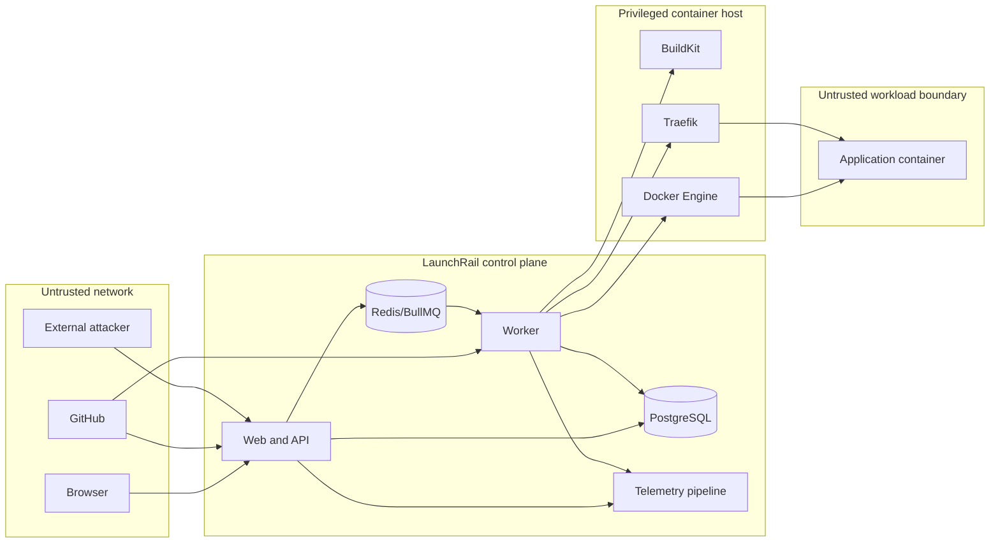

# Initial threat model

## Plain-language overview

LaunchRail handles unusually powerful operations: it downloads code, builds Dockerfiles, starts containers, stores application secrets, and changes network routes. A malicious repository or stolen account could therefore affect more than one deployment. The design treats source code and workloads as untrusted even though the first supported operator and host are trusted.

This initial model identifies security requirements. Phases 1 through 6 implement foundational structured-log redaction, loopback-bound services, organization-scoped foreign keys, immutable deployment/source snapshots, health-gated active-release constraints, password authentication, hashed opaque sessions, organization role enforcement, request hardening, validated project input, authenticated environment-variable encryption, identity/project/deployment audit insertion, identifier-only fenced jobs, fixed-origin public GitHub resolution, and hardened exact-SHA checkout/containment. Password recovery/second factors, private-source authentication, deployment-time secret injection, image/workload isolation, and the remaining controls are not claimed as complete.

## Scope and assumptions

### In scope

- Browser, web application, API, worker, database, Redis queue, telemetry path, and local reverse proxy.
- GitHub repository input and webhook delivery.
- Build context, BuildKit, image artifacts, Docker runtime, preview routes, and cleanup.
- User sessions, organization boundaries, encrypted environment variables, logs, and audit events.
- Single-host development and demonstration deployments.

### Assumptions

- The machine owner and LaunchRail operator are trusted.
- PostgreSQL, Redis, Docker, and internal telemetry services are not exposed directly to the public internet.
- TLS termination for non-local access is configured outside or at the proxy boundary.
- GitHub and pinned upstream packages are external dependencies, not fully trusted components.
- Docker daemon compromise is equivalent to host compromise in the initial design.

### Out of scope for the initial release

- Protection against a malicious host administrator.
- Strong isolation for mutually hostile public tenants.
- Multi-host control-plane security and cross-region secrets.
- Billing fraud, enterprise identity federation, and regulatory certification.

## Assets

| Asset                        | Security need                                                       |
| ---------------------------- | ------------------------------------------------------------------- |
| User session                 | Confidentiality, integrity, revocation, bounded lifetime            |
| Organization/project data    | Tenant isolation and authorized modification                        |
| Environment variables        | Encryption, access control, redaction, rotation                     |
| GitHub/webhook credentials   | Minimal scope, signature integrity, rotation                        |
| Source checkout              | Exact revision integrity and bounded contents                       |
| Built image                  | Traceability to source/configuration and tamper detection           |
| Docker host                  | Protection from workload escape and resource exhaustion             |
| Active route                 | Integrity and availability; must target an approved healthy release |
| Deployment history/audit log | Integrity, ordering, retention, actor attribution                   |
| Logs/metrics/traces          | Availability without leaking secrets or tenant data                 |
| Encryption keys              | Separation from ciphertext, restricted access, versioned rotation   |

## Actors

- **Viewer:** reads permitted projects, deployments, and redacted logs.
- **Developer:** creates projects and deployments and manages non-administrative configuration.
- **Organization owner/administrator:** manages memberships, archival, sensitive settings, and secrets.
- **LaunchRail operator:** controls the host and infrastructure configuration.
- **GitHub:** supplies source data and signed webhook events.
- **Deployed application:** untrusted workload that may be vulnerable or intentionally malicious.
- **External attacker:** may target public HTTP endpoints, preview applications, or leaked credentials.
- **Compromised account/repository/dependency:** acts with legitimate-looking input or credentials.

## Trust boundaries

Crossing a boundary requires authenticated protocols, validated schemas, bounded payloads, explicit authorization, and safe error handling appropriate to that boundary.

## Threat scenarios and required mitigations

| Threat                                  | Example impact                                                | Planned controls                                                                                                                         | Evidence required before claiming mitigation                     |
| --------------------------------------- | ------------------------------------------------------------- | ---------------------------------------------------------------------------------------------------------------------------------------- | ---------------------------------------------------------------- |
| Session theft or fixation               | Account takeover                                              | Hashed opaque sessions, secure/HTTP-only/SameSite cookies, absolute/idle expiry, revocation, origin defense                              | Implemented for local passwords; integration tested              |
| Cross-organization access               | Read or mutate another team's project/secrets                 | Membership lookup, role checks, organization-scoped queries, deny-by-default policies                                                    | Identity/project routes integration tested                       |
| Server-side request forgery             | Repository or health URL reaches internal services            | Fixed GitHub API/HTTPS origins, rejected redirects/credentials, direct runtime health targets, blocked private destinations where needed | Source provider fixed-origin tests; health remains later         |
| Command injection                       | Crafted branch, path, or environment value runs host commands | Typed validated values, fixed executable/argument arrays, no shell interpolation, isolated Git environment, checkout containment         | Project and hostile Git adapter tests passed                     |
| Source substitution or tampering        | Worker builds content other than the approved revision        | Resolve before persistence, exact SHA/tree/blob verification, immutable metadata, revalidated checkout marker                            | Branch-race/tamper/restart fixtures passed                       |
| Malicious Dockerfile/build              | Host compromise, secret theft, denial of service              | Dedicated BuildKit policy, no control-plane secrets in context, bounded resources/time/storage/network, cleanup                          | Adversarial example builds and resource tests                    |
| Container escape or Docker socket abuse | Host takeover                                                 | No Docker socket in workloads, non-root user, dropped capabilities, read-only filesystem where viable, seccomp/AppArmor, resource limits | Runtime policy inspection and escape-oriented tests              |
| Secret leakage                          | Credentials in logs, UI, metrics, images, cache, traces       | Authenticated encryption, scoped metadata/read APIs, structured-log redaction, no secret job/build arguments by default                  | Control-plane canaries tested; future channels pending           |
| Forged/replayed webhook                 | Unauthorized or duplicate deployment                          | HMAC verification over raw bytes, timestamp/size controls, unique delivery ID, branch filters                                            | Invalid-signature and duplicate-delivery tests                   |
| Queue message tampering/duplication     | Invalid transitions or repeated side effects                  | Private Redis, identifier-only strict schemas, stable idempotency keys, PostgreSQL state re-read, leases/fencing, bounded retries        | Unit and clean-service integration tests passed                  |
| Route takeover/collision                | Traffic sent to wrong organization or release                 | Deterministic collision-resistant hostnames, unique constraints, authorized route intent, reconciliation                                 | Collision tests and proxy integration tests                      |
| Log injection/resource exhaustion       | Misleading UI or unavailable telemetry                        | Structured encoding, display escaping, chunk/rate/retention limits, sequence IDs                                                         | Control-character, high-volume, and reconnect tests              |
| Dependency or image compromise          | Malicious control-plane/runtime code                          | Lockfile, reviewable updates, provenance where available, dependency/image scanning                                                      | Production dependency audit is currently green; image scan later |
| Destructive control misuse              | Unauthorized stop/cancel/rollback                             | Role checks, confirmation UI, idempotent commands, audit events                                                                          | Authorization and audit integration tests                        |
| Worker crash at side-effect boundary    | Duplicate work or incorrect state                             | Persist-before-act, leases/fencing, idempotent transitions, revalidated checkout adoption/reconciliation; later resources use labels     | Claim/source restart clean-service tests passed                  |

Phase 6's BullMQ messages contain only `{ contractVersion, kind, workItemId }`; strict validation rejects authority, repository, configuration, correlation, and secret fields. PostgreSQL determines immutable source input, deployment, and organization; fences every lease mutation; owns attempts/dead letters; and supplies stable idempotency for atomic claim/source transitions and completion. Redis provides at-least-once wake-ups, not authority or exactly-once execution. Clean-service CI verifies claim-through-source restart behavior; Phase 14 still owns broad service interruption and orphan cleanup across source, build, runtime, proxy, and cleanup boundaries.

## Repository and build policy

- Accept canonical GitHub HTTPS repository references initially; reject local paths, alternate schemes, credentials in URLs, and ambiguous hosts.
- Resolve a branch/tag to an exact commit, then clone/fetch that commit within size, file-count, time, and path limits.
- Use fixed GitHub origins without redirects/authentication; disable ambient Git configuration, credentials, proxies, hooks, smudge filters, submodules, and non-HTTPS protocols.
- Verify the provider tree and live commit/tree/blob manifest; reject unsupported modes, special files, LFS pointers, unsafe symlinks, and mismatches.
- Keep control-plane credentials out of the build context and `.dockerignore` generated metadata.
- Validate the Dockerfile resolves inside the checkout to a non-empty bounded regular file and persist its portable path/digest.
- Treat Dockerfile directives and build output as untrusted; never convert them into shell commands or HTML.
- Label images and containers with opaque LaunchRail IDs for reconciliation, not user-provided names.

Phase 4 implements the offline project syntax boundary. Phase 6 implements the public GitHub provider, exact-SHA isolated checkout, provider/live-manifest integrity checks, source limits, symlink and Dockerfile containment, safe failure mapping, immutable portable metadata, and crash-safe adoption. It deliberately does not authenticate private repositories, support Git LFS/submodules, or build/execute the checkout. The deployment-start HTTP/UI boundary is also absent, so source work currently requires an internally persisted immutable deployment.

## Workload isolation baseline

The exact policy will be tested against the supported Docker version. The initial target is:

- Non-root application user or explicit documented exception.
- No privileged containers, host PID/IPC namespace, host devices, or Docker socket.
- Dropped Linux capabilities with only demonstrated additions.
- CPU, memory, process, storage, log, and execution-time limits.
- Read-only root filesystem and temporary writable mounts where compatible.
- Controlled network attachment and no access to control-plane service networks.
- Bounded port exposure only through the reverse proxy.
- Cleanup and reconciliation for stopped/orphaned resources.

Build isolation remains weaker than a hardened remote builder because BuildKit and Docker share the trusted host. This residual risk is accepted only for trusted local operation in early releases.

## Secret lifecycle

1. Validate secret names and size at the API boundary.
2. Encrypt values with AES-256-GCM, a fresh nonce/tag, and organization/project/name authenticated context.
3. Store ciphertext, nonce, authentication tag, algorithm, and key version in PostgreSQL; store the keyring separately.
4. Decrypt only in the worker immediately before runtime injection.
5. Redact exact and encoded canary forms before emitting logs/events.
6. Never return stored plaintext through read APIs.
7. Audit create, update, delete, and access operations without recording the value.
8. Support key rotation by version and re-encryption without changing the logical secret.

Phase 4 implements steps 1–3, the no-plaintext API part of step 6, value-free write/delete audit events in step 7, and versioned active/historical keys for step 8. Phases 5 and 6 additionally enforce and verify that producer-approved Redis job payloads contain no secret or repository/configuration data; source Git processes inherit no control-plane token/proxy variables. Runtime decryption/injection, exact/encoded runtime-output redaction, secret-access auditing, and automated re-encryption remain future work. Operators must retain historical keys until every referenced row is replaced.

## Security verification gates

- Threat-model review when a trust boundary or privileged adapter changes.
- Dependency review and automated vulnerability scanning.
- Static checks for secrets and unsafe patterns.
- Authentication, authorization, webhook, redaction, and runtime-policy tests.
- Adversarial example applications for build, health, and log behavior.
- Manual inspection of Docker and proxy configuration in release setup verification.

## Residual risks

Even after current controls, the single host, third-party dependencies, retained untrusted source, future execution of user-supplied builds, locally managed keyring, and absent automated key re-encryption remain material risks. The source filesystem budget is polling-based rather than a kernel quota, public GitHub availability/rate limits are external dependencies, and hard-crash staging/final-checkout inventory remains Phase 14 work. Phase 6 does not provide a deployment-start route, queue-readiness endpoint, private-source support, or broad external-resource recovery. Production-readiness claims require an updated model, external review, build/runtime isolation testing, incident processes, backups, managed keys, and operational evidence beyond the current milestone.

## Review triggers

Review this model whenever LaunchRail adds private repositories, new authentication methods, multi-host execution, shared public hosting, new build/runtime engines, outbound application networking controls, secret providers, or a new external telemetry destination. Also review it after any security incident or failed isolation test.
